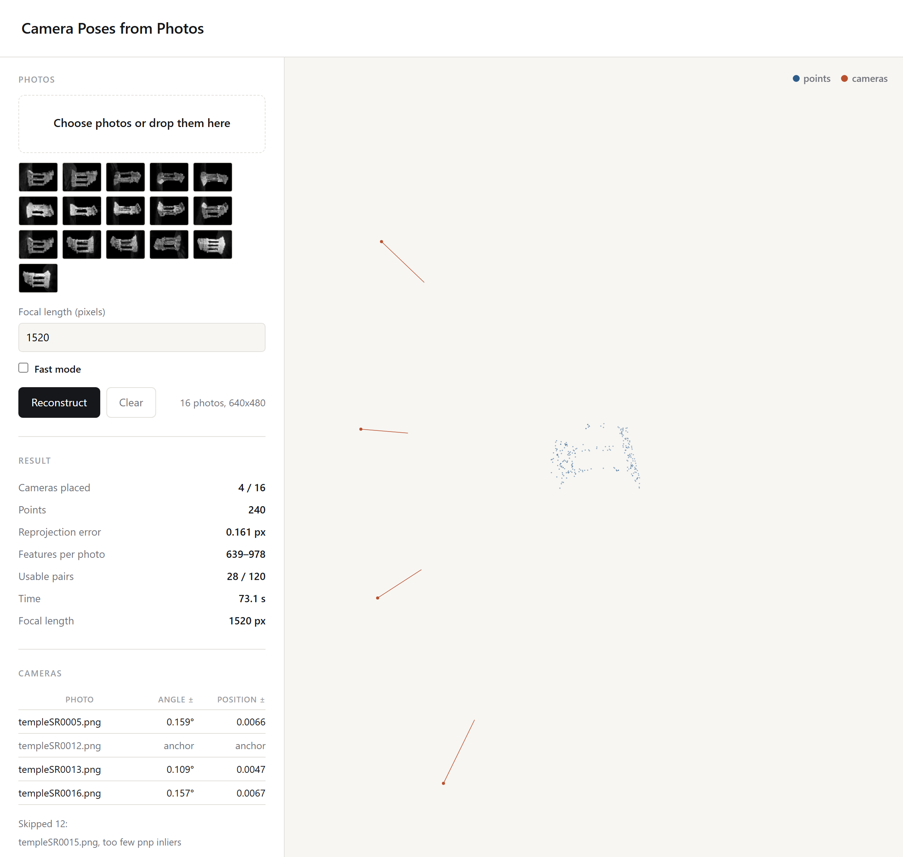

Reconstructs camera positions and a sparse point cloud from a set of photos taken around an object. 



Python 3.11+, Node 18+.

## Output

The point cloud is sparse. Each point is a feature matched across several photos, so it marks the object's shape without forming a surface. 

On the 16-image Middlebury temple set at focal 1520:

| | |
|---|---|
| Cameras placed | 4 of 16 |
| Points | 247 |
| Reprojection error | 0.1511 px |
| Reported angle error | 0.10° – 0.15° |
| True angle error | 0.12° – 0.34° |


## Method

Eight-point algorithm, Hartley normalisation, essential matrix projection onto `[s, s, 0]`, cheirality check, RANSAC, Levenberg-Marquardt.

Two parameters were set by measurement:

- RANSAC thresholds are tight because 2 outliers among 263 points increased the direction error by a factor of 9.
- Track growth is disabled because doubling the point count increased the error by a factor of 8.

**Schur complement.** The hessian is 95.7 percent zeros, and its point block is block diagonal. 

## Rejecting underdetermined cameras

Reprojection error does not distinguish a well-constrained solution from an unconstrained one. Two photos taken from the same viewpoint produce near-zero residuals and no usable geometry. 

The rank of `JᵀJ` does distinguish them. Its null space counts directions the data leaves undetermined:

```
null space 1     scale only, expected
null space > 1   rejected
```

Absolute scale is never recoverable from images, so one null direction is normal. 

The scale ambiguity is visible twice: the eight-point system has rank 8 of 9, and the hessian is one dimension short.

## SIFT

Implemented from scratch in JavaScript and compared against OpenCV on the same images:

| | |
|---|---|
| Keypoints within 1 px, both directions | 100% |
| Descriptor cosine similarity | 1.0000 |

Five implementation details affect whether descriptors match OpenCV numerically: the orientation angle is negated, gradients use a y-up convention, the keypoint is rounded to an integer pixel, the contrast threshold is applied before normalisation, and output is scaled by 512 and clamped to 0-255 even in float mode.

## Two implementations

The pipeline exists in python and JavaScript on different linear algebra libraries:

| | Difference |
|---|---|
| Fundamental matrix | < 1e-9 |
| Rotation angle | 1.207e-6 degrees |
| Translation direction | 0.000e+0 |
| Point cloud | < 1e-8 |

## Layout

```
sfm/core/     
tests/        

web/src/     
web/tests/    
web/vendor/   
```

## Data

`data/templeSparseRing` is not in the repository. It is available from
[vision.middlebury.edu/mview/data](https://vision.middlebury.edu/mview/data/) and includes gantry-measured camera positions, which the error columns above are checked against.
